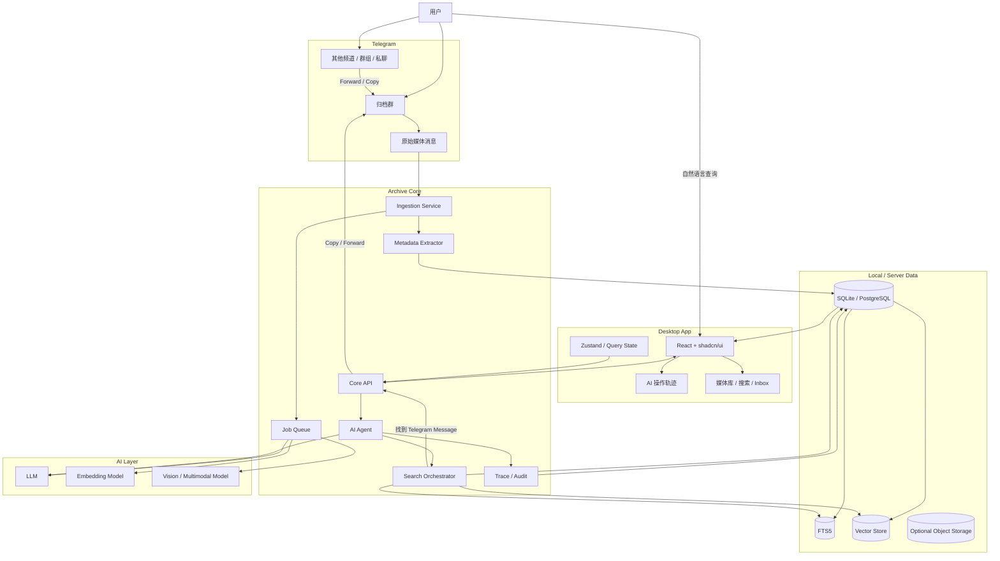
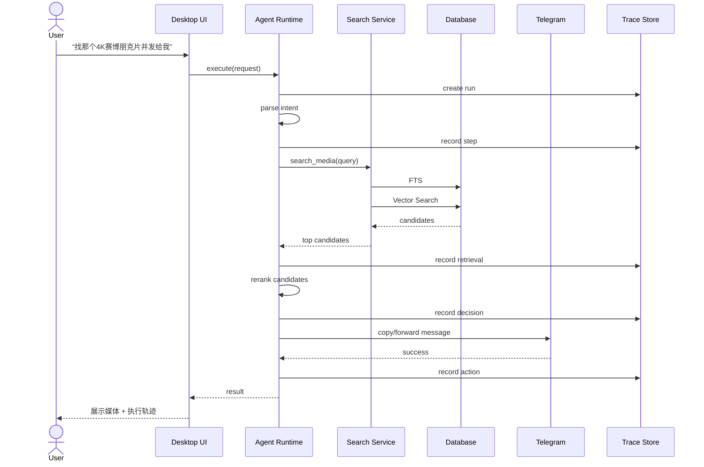
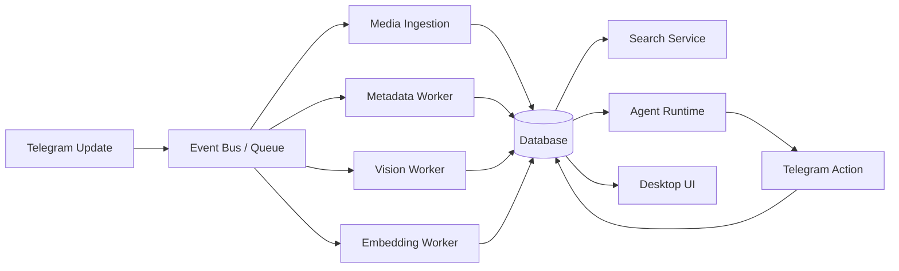
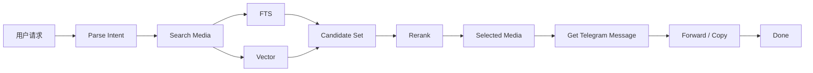
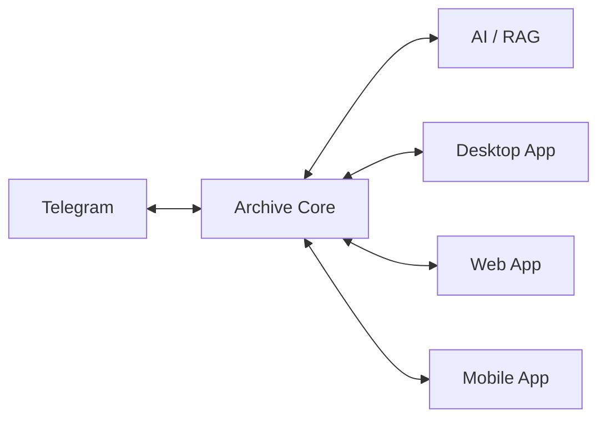

# Telegram Media Archive — AI 媒体归档整理器
## 架构设计稿 / Architecture Design Document

> 项目定位：一个以 Telegram 为原始媒体仓库、以 AI Agent + RAG 为智能层、以 Tauri + React + shadcn/ui 为桌面工作台的媒体归档整理器。
>
> 核心理念：**Telegram 保存原始内容，归档系统保存“理解、索引、关系和操作记录”，桌面端负责让这一切可视化、可控制、可追踪。**

---

## 1. 项目愿景

这个项目不再把 Telegram 当成“网盘的底层存储”，也不再为了播放而额外搭建 OpenList / Teldrive / Web 播放器。

Telegram 本身已经同时承担：

- 媒体原始存储
- 原始消息
- 媒体预览与播放
- 转发 / Copy
- 归档群组的操作入口

本项目真正增加的是上面这一层：

```text
Telegram
   │
   │ 原始媒体 + 原始消息
   ▼
Archive Core
   │
   ├── Metadata / 元数据
   ├── Full Text Search / 全文索引
   ├── Vector Search / 语义检索
   ├── AI Analysis / AI 分析
   ├── Agent / 工具调用
   ├── Audit / 操作轨迹
   └── Job Queue / 异步任务
   │
   ▼
Desktop App
   ├── 媒体库
   ├── 搜索
   ├── AI 活动
   ├── 操作轨迹
   └── 系统设置
```

最终形成一个“AI 赋能的媒体归档整理器”。

它的重点不是“把文件搬到哪里”，而是：

> **让 AI 理解我有什么、它们是什么、它们在哪里、我为什么这么标记，以及当我提出自然语言请求时应该调用哪些系统能力。**

---

# 2. 产品形态

## 2.1 用户视角

典型流程：

```text
从其他 Telegram 群 / 频道发现媒体
            │
            ▼
      转发到归档群
            │
            ▼
        Archive Bot
            │
     ┌──────┴──────┐
     ▼             ▼
读取 Telegram     解析附言
媒体元数据        / 用户意图
     │             │
     └──────┬──────┘
            ▼
       AI / Metadata
            │
            ▼
       写入归档数据库
            │
     ┌──────┼─────────────┐
     ▼      ▼             ▼
   FTS    Vector        Tags
     │      │             │
     └──────┴──────┬──────┘
                    ▼
                媒体库
```

之后用户不需要知道准确文件名。

例如：

```text
找一下那个压抑一点的、未来城市、
讲 AI 和人类关系的科幻电影
```

系统可以：

1. 从结构化字段过滤；
2. 用 FTS 搜索标题、简介、标签；
3. 用向量检索做语义召回；
4. Agent 对候选结果进行理解和排序；
5. 定位 Telegram 原消息；
6. Copy / Forward 原消息给用户。

Telegram 继续负责最终播放。

---

# 3. 总体架构

## 3.1 Master Architecture



---

# 4. 核心架构思想

## 4.1 Telegram 是 Source of Truth

Telegram 中的原始消息是事实源。

数据库中的：

- 元数据
- 标签
- embedding
- AI 摘要
- AI 推断
- 搜索索引
- 操作记录

全部属于“派生数据”。

因此数据库损坏以后，理论上可以重新扫描 Telegram 并重建索引。

这会让系统非常适合长期维护。

---

## 4.2 Media Asset 与 Telegram Message 解耦

不要直接把一个 Telegram Message 等价成一个媒体。

应该有：

```text
MediaAsset
    │
    ├── TelegramMessage #1
    ├── TelegramMessage #2
    ├── TelegramMessage #3
    │
    ├── Metadata
    ├── Tags
    ├── Embeddings
    └── Annotations
```

原因：

同一个文件可能被：

- 转发多次
- 出现在不同频道
- 有多个不同的来源
- 有不同的用户备注

逻辑上它们可能是同一个媒体对象。

因此应该区分：

```text
媒体是什么
```

和

```text
它在哪里出现过
```

---

# 5. 分层设计

建议明确拆成六层。

```text
┌──────────────────────────────────┐
│          Presentation            │
│ Tauri / React / shadcn/ui        │
├──────────────────────────────────┤
│        Application Layer         │
│ Commands / Queries / Use Cases   │
├──────────────────────────────────┤
│          Agent Layer             │
│ Planner / Tools / RAG / LLM      │
├──────────────────────────────────┤
│        Domain / Search           │
│ Media / Metadata / FTS / Vector  │
├──────────────────────────────────┤
│      Infrastructure Layer        │
│ Telegram / SQLite / AI Provider  │
├──────────────────────────────────┤
│         External Systems         │
│ Telegram / LLM / Embedding       │
└──────────────────────────────────┘
```

## 5.1 Presentation Layer

桌面端：

- Tauri
- React
- TypeScript
- Vite
- shadcn/ui
- Tailwind
- Zustand
- TanStack Query

主要页面：

```text
Dashboard
Library
Inbox
Search
AI Activity
AI Run Detail
Media Detail
Sources
Settings
```

---

## 5.2 Application Layer

这一层负责真正的业务用例。

例如：

```text
ArchiveMedia
AnalyzeMedia
SearchMedia
AddAnnotation
TagMedia
MoveMedia
FindSimilar
ForwardMedia
ReindexMedia
RetryJob
```

UI 不直接操作数据库。

UI：

```text
button
  ↓
command
  ↓
use case
  ↓
domain service
  ↓
repository
```

---

# 6. Archive Core

建议把真正的核心程序独立出来。

```text
archive-core
├── telegram
├── ingestion
├── metadata
├── search
├── agent
├── ai
├── jobs
├── trace
├── database
└── api
```

这样桌面端只是一个控制台。

以后完全可以出现：

```text
Desktop App
      │
      ▼
Local Archive Core
```

或者：

```text
Desktop App
      │
      ▼
Remote Archive Core
      │
      ├── Telegram
      ├── Database
      └── AI
```

于是未来做 Web UI、手机 App、远程管理界面都不用重写核心。

---

# 7. Telegram Ingestion

## 7.1 归档入口

归档群是整个系统最重要的“人机交互入口”。

```text
其他地方
   │
   │ Forward
   ▼
归档群
   │
   ▼
Archive Bot
```

Bot 收到 Telegram Update 后立即创建一个 ingestion event。

---

## 7.2 Ingestion Event

建议内部统一成：

```json
{
  "event": "telegram.message.received",
  "chatId": 123456,
  "messageId": 789,
  "receivedAt": "2026-09-28T12:00:00Z",
  "media": {
    "type": "video",
    "fileId": "...",
    "fileUniqueId": "...",
    "fileName": "Movie.2025.2160p.WEB-DL.mkv",
    "mime": "video/x-matroska",
    "size": 1234567890,
    "duration": 7200,
    "width": 3840,
    "height": 2160
  },
  "caption": "4K 绝命毒师 在线播放"
}
```

注意：

**归档时不需要下载整个视频。**

这对于大型媒体非常关键。

---

# 8. Metadata Pipeline

解析应该分成三层。

## Layer A：Deterministic Extraction

直接读取 Telegram / 文件字段：

```text
filename
mime
size
duration
width
height
caption
source
message_id
```

这是最可靠的数据。

---

## Layer B：Rule Based Parser

从文件名提取：

```text
4K
2160p
1080p
WEB-DL
BluRay
HDR
HEVC
H264
S01
E03
2026
```

例如：

```text
Breaking.Bad.S05E10.2160p.WEB-DL.DDP5.1.H.265
```

解析为：

```json
{
  "title": "Breaking Bad",
  "season": 5,
  "episode": 10,
  "quality": "2160p",
  "source": "WEB-DL",
  "codec": "H.265",
  "audio": "DDP5.1"
}
```

---

## Layer C：AI Enrichment

AI 只处理规则无法可靠处理的东西：

```text
用户备注理解
语义描述
分类
标签
内容主题
视觉内容
摘要
模糊标题归一化
自然语言意图
```

例如：

```text
4K 绝命毒师 在线播放
```

转成：

```json
{
  "title": "Breaking Bad",
  "quality": "2160p",
  "intent": "play"
}
```

---

# 9. Vision / Multimodal Pipeline

不要把完整电影上传给视觉模型。

优先使用：

```text
Telegram metadata
      +
filename
      +
caption
      +
thumbnail / preview
      +
user annotation
```

组合成 AI 输入。

例如：

```text
filename:
Blade.Runner.2049.2160p...

caption:
未来城市氛围特别强

thumbnail:
[image]
```

AI 可以生成：

```json
{
  "title": "Blade Runner 2049",
  "themes": [
    "AI",
    "人类关系",
    "赛博朋克",
    "未来都市"
  ],
  "mood": [
    "压抑",
    "冷峻"
  ],
  "summary": "..."
}
```

---

# 10. Search Architecture

搜索不要只做 Vector Search。

本项目应该使用 Hybrid Retrieval。

```text
User Query
   │
   ▼
Intent Parser
   │
   ├── Structured Filters
   │
   ├── FTS Search
   │
   └── Vector Search
          │
          ▼
     Candidate Set
          │
          ▼
      Reranker
          │
          ▼
       Results
```

---

## 10.1 Structured Search

适合：

```text
4K
电影
2025
H.265
S02
```

---

## 10.2 FTS

适合：

```text
绝命毒师
Breaking Bad
赛博朋克
未来城市
AI
```

SQLite 使用 FTS5 即可满足 MVP。

---

## 10.3 Vector Search

适合：

```text
那个压抑一点的、
未来城市、
讲 AI 和人类关系的科幻片
```

即使没有完全匹配的关键词，也可以找到语义相近的内容。

---

## 10.4 LLM Reranking

Vector Search 得到：

```text
Top 20
```

再让 LLM 判断：

```text
哪些真正符合用户描述？
```

最终返回：

```text
Top 3
```

不要让 LLM 自己从整个数据库里“想象”答案。

---

# 11. Agent Architecture

Agent 不应该成为一个“什么都自己做”的黑箱。

应该是：

```text
User Request
      │
      ▼
Intent / Planner
      │
      ├── search_media()
      ├── get_media()
      ├── find_similar()
      ├── annotate_media()
      ├── tag_media()
      ├── forward_media()
      └── reindex_media()
```

例如：

```text
用户：
找那个 4K 的赛博朋克片，
然后发给我。
```

Agent：

```text
1. 识别 intent = search + forward
2. 搜索：
   quality = 2160p
   semantic = cyberpunk
3. 得到候选
4. 选择最符合的 MediaAsset
5. 定位 Telegram message
6. 调用 forward_media()
7. 返回结果
```

---

# 12. Tool Contract

Agent 只允许调用明确工具。

建议首批工具：

```text
search_media
get_media
find_similar
get_source
annotate_media
tag_media
forward_media
copy_media
reindex_media
```

例如：

```json
{
  "name": "search_media",
  "description": "搜索媒体库",
  "input": {
    "query": "string",
    "filters": {
      "quality": "2160p",
      "type": "movie"
    },
    "limit": 10
  }
}
```

---

# 13. AI 操作轨迹

这是桌面端非常值得做的一部分。

不要只显示：

```text
AI 已完成
```

而是显示：

```text
AI Run #1842

用户：
“找那个压抑的赛博朋克科幻片并发给我”

│
├─ Step 1 解析意图
│   intent = search + forward
│
├─ Step 2 search_media()
│   query = “压抑 赛博朋克 科幻”
│
├─ Step 3 Vector Search
│   candidates = 17
│
├─ Step 4 Rerank
│   candidates = 3
│
├─ Step 5 get_media()
│   media_id = 281
│
├─ Step 6 forward_media()
│   telegram_message_id = 8891
│
└─ Done
```

UI 可以做成时间线：

```text
● Parse Intent
│
● Search Metadata
│
● Vector Retrieval
│
● Rerank
│
● Locate Telegram Message
│
● Forward
│
✓ Completed
```

这样用户可以真正看到 AI 的“思考外显路径”。

注意：

这里展示的是**可审计的执行轨迹 / tool trace**，不是模型隐藏的 chain-of-thought。

---

# 14. Trace 数据模型

建议：

```text
ai_runs
├── id
├── user_request
├── status
├── model
├── started_at
├── finished_at
└── total_cost

ai_steps
├── id
├── run_id
├── step_index
├── type
├── tool_name
├── input
├── output
├── status
├── latency_ms
├── token_usage
├── error
└── created_at
```

`input/output` 可以做敏感字段脱敏。

---

# 15. AI Agent Execution Flow



---

# 16. Desktop Architecture

Tauri 桌面端建议不要把所有业务都塞进 Rust。

推荐：

```text
Tauri
│
├── Rust Shell
│   ├── Window
│   ├── Native API
│   ├── File System
│   └── Process / Sidecar Management
│
├── React UI
│   ├── Pages
│   ├── Components
│   ├── State
│   └── Query
│
└── Archive Core
    ├── Telegram
    ├── AI
    ├── Search
    ├── DB
    └── Jobs
```

开发阶段：

```text
Tauri
  │
  └── localhost
          │
          ▼
       Core Dev Server
```

生产桌面版：

```text
Tauri
  │
  └── Sidecar
          │
          ▼
       archive-core
```

这样既保持前端开发效率，又不强迫所有业务都进入 Rust。

---

# 17. 为什么 Core 要独立

因为未来会出现：

```text
            ┌───────────────┐
            │ Archive Core  │
            └───────┬───────┘
                    │
       ┌────────────┼─────────────┐
       ▼            ▼             ▼
   Tauri App     Web App      Telegram Bot
```

桌面端只是其中一种客户端。

这样以后甚至可以：

```text
手机
  │
  ▼
Web App
  │
  ▼
Remote Core
```

而核心归档逻辑完全不需要修改。

---

# 18. 数据模型

推荐至少有以下实体。

```text
media_asset
telegram_message
media_metadata
media_tag
media_annotation
media_embedding
media_source
jobs
ai_runs
ai_steps
audit_events
```

---

## 18.1 media_asset

```text
id
file_unique_id
canonical_title
type
mime
size
duration
width
height
created_at
updated_at
```

---

## 18.2 telegram_message

```text
id
media_asset_id
chat_id
message_id
sender_id
caption
file_id
is_primary
created_at
```

一个 `media_asset` 可以对应多个 Telegram message。

---

## 18.3 media_metadata

```text
media_asset_id
year
season
episode
quality
codec
source
audio
description
summary
```

---

## 18.4 media_tag

```text
media_asset_id
tag
source
confidence
```

`source` 可以是：

```text
user
rule
llm
vision
```

这样可以追溯标签来源。

---

## 18.5 media_annotation

```text
id
media_asset_id
user_id
raw_text
parsed_intent
created_at
```

原文一定要保留。

例如：

```text
用户原话：
4K 绝命毒师 在线播放
```

同时保存：

```json
{
  "title": "Breaking Bad",
  "quality": "2160p",
  "intent": "play"
}
```

这样 AI 判断错误时可以重新处理原始文本。

---

# 19. Job Queue

AI 分析不要阻塞 Telegram Update。

正确路径：

```text
Telegram Update
      │
      ▼
Create DB Record
      │
      ▼
Enqueue Job
      │
      ├──── Metadata Job
      ├──── Vision Job
      ├──── Embedding Job
      └──── AI Enrichment Job
```

这样即使：

```text
LLM 挂了
Embedding API 挂了
Vision API 超时
```

归档本身依然成功。

---

## MVP 阶段

不需要 Redis。

直接 SQLite：

```text
jobs
├── id
├── type
├── payload
├── status
├── attempts
├── available_at
├── started_at
├── finished_at
└── error
```

Worker 定期领取任务即可。

以后再升级：

```text
SQLite Queue
      ↓
Redis / NATS / RabbitMQ
```

---

# 20. 数据库策略

## MVP

```text
SQLite
 ├── Main Tables
 ├── FTS5
 ├── Job Queue
 └── AI Trace
```

优点：

- 单文件
- 桌面端非常方便
- 备份简单
- 不需要数据库服务
- 适合单用户 / 小规模媒体库

---

## Vector Store

抽象成接口：

```text
VectorStore
├── LocalVectorStore
├── SQLiteVectorStore
├── LanceDBAdapter
├── QdrantAdapter
└── PgVectorAdapter
```

MVP 可以先做一种。

不要让整个系统绑死在具体 Vector DB 上。

---

## Server Mode

以后需要多人 / 远程访问时：

```text
PostgreSQL
+
pgvector
```

或者：

```text
PostgreSQL
+
Qdrant
```

---

# 21. 存储原则

数据库不要保存媒体本体。

```text
Telegram
  = Raw Media

Database
  = Index / Knowledge / State

AI
  = Derived Intelligence

Desktop
  = Control / Visualization
```

这会让整个系统非常轻量。

---

# 22. Event-Driven Architecture

内部建议使用事件模型。



统一事件名称：

```text
telegram.message.received
media.created
media.updated
media.analyzed
embedding.created
annotation.created
ai.run.started
ai.step.created
ai.run.completed
telegram.message.forwarded
job.failed
```

事件会让未来增加插件变得容易。

---

# 23. Desktop UI 信息架构

建议：

```text
┌─────────────────────────────────────────────┐
│ Media Archive                               │
├─────────────┬───────────────────────────────┤
│ Dashboard   │                               │
│ Library     │         Main Content          │
│ Inbox       │                               │
│ Search      │                               │
│ AI Activity │                               │
│ Sources     │                               │
│ Settings    │                               │
└─────────────┴───────────────────────────────┘
```

---

## Dashboard

显示：

```text
今日归档
待处理任务
AI 分析数
失败任务
最近媒体
最近 AI Run
```

---

## Inbox

类似一个“AI 待办箱”。

```text
[待分析] Movie.2160p...
[解析失败] Unknown_123.mkv
[需要确认] 可能是两个不同版本
[已完成] Breaking Bad S05E10
```

---

## Library

类似传统媒体管理软件：

```text
Grid
List
Cards
Filter
Sort
```

筛选：

```text
类型
年份
分辨率
标签
来源
AI 状态
```

---

# 24. AI Activity

这是本产品区别于普通媒体库的核心页面之一。

可以显示：

```text
AI Activity

10:21:04  分析 Blade Runner 2049
10:21:07  提取标签：赛博朋克
10:21:07  提取主题：AI / 人类关系
10:21:08  Embedding 完成

10:21:31  用户发起搜索
10:21:31  FTS 命中 12 条
10:21:31  Vector 命中 20 条
10:21:32  Rerank
10:21:32  Forward completed
```

---

# 25. AI Run Detail

建议做成类似开发工具里的执行面板。

```text
AI Run #1842

Request
────────────────────────
找那个压抑的赛博朋克片并发给我


Execution
────────────────────────

01 ParseIntent                  ✓
02 search_media                 ✓
03 vector_search                ✓
04 rerank                       ✓
05 get_media                    ✓
06 forward_media                ✓


Final Result
────────────────────────
Blade Runner 2049
```

每一步都可以展开。

---

# 26. 可视化“AI 操作路径”

可以做成 Graph：



桌面端可以把这个图做成真正可交互的节点图。

例如点击：

```text
Vector Search
```

可以看到：

```text
Embedding Model
Query Vector
Top K = 20
Latency = 86 ms
```

点击：

```text
Forward Media
```

可以看到：

```text
chat_id
message_id
action
status
```

但敏感信息需要脱敏。

---

# 27. Source Tracking

每个媒体都应该知道：

```text
它来自哪里
谁转发的
什么时候归档
是否为重复媒体
```

例如：

```text
Media:
Blade Runner 2049

Sources:
├── Channel A / Message 123
├── Channel B / Message 889
└── Archive Group / Message 1821

Preferred Source:
Channel B / Message 889
```

最终播放 / 转发可以优先选择可用的 source。

---

# 28. 去重策略

第一层：

```text
file_unique_id
```

第二层：

```text
size
+
duration
+
filename normalization
```

第三层可以使用：

```text
content hash
```

但是 MVP 不建议为大视频下载全文计算 hash。

优先利用 Telegram 元数据。

---

# 29. 归档群作为 UI

这是一个非常重要的产品设计。

Telegram 群不只是“Bot 的输入来源”。

它本身就是：

```text
操作入口
消息审计
原始内容
人工补充
```

例如：

```text
[Forward Video]

附言：
4K 绝命毒师 S05E10
标记为电视剧
```

Bot 可以自动处理。

用户也可以：

```text
回复某条媒体：

“这个是值得收藏的”
```

然后：

```text
annotation = 收藏
```

再回复：

```text
找类似的
```

Agent 自动以当前回复的媒体作为上下文。

---

# 30. Reply Context

一个很值得实现的功能：

```text
回复某条媒体
      │
      ▼
Bot 读取 replied message
      │
      ▼
current_media_id
```

于是：

```text
“找类似的”
```

就可以理解为：

```text
find_similar(current_media_id)
```

而不是让用户再次描述媒体。

---

# 31. 远程 / 本地两种部署模式

## Local Mode

适合个人：

```text
Tauri
 │
 └── Archive Core
       ├── SQLite
       ├── Telegram
       └── AI APIs
```

优点：

- 极简
- 私有
- 低成本
- 不需要常驻服务器

---

## Server Mode

适合长期在线归档：

```text
Telegram
   │
   ▼
Remote Archive Core
   │
   ├── PostgreSQL
   ├── Vector DB
   ├── Workers
   └── AI Gateway
        ▲
        │
     Desktop
```

桌面端只是远程管理界面。

---

# 32. 推荐 Repository 结构

```text
telegram-media-archive/
├── apps/
│   ├── desktop/
│   │   ├── src/
│   │   ├── src-tauri/
│   │   └── package.json
│   │
│   ├── core/
│   │   ├── src/
│   │   │   ├── api/
│   │   │   ├── agent/
│   │   │   ├── ai/
│   │   │   ├── database/
│   │   │   ├── ingestion/
│   │   │   ├── jobs/
│   │   │   ├── metadata/
│   │   │   ├── search/
│   │   │   ├── telegram/
│   │   │   └── trace/
│   │   └── package.json
│   │
│   └── web/
│       └── (future)
│
├── packages/
│   ├── ui/
│   ├── domain/
│   ├── shared/
│   ├── ai-sdk/
│   ├── telegram-sdk/
│   └── search-sdk/
│
├── migrations/
├── docs/
├── scripts/
├── package.json
├── pnpm-workspace.yaml
└── README.md
```

---

# 33. 前端技术栈

推荐：

```text
React
TypeScript
Vite
Tailwind CSS
shadcn/ui
Zustand
TanStack Query
React Router
```

可选：

```text
TanStack Table
React Flow
Lucide
```

其中：

- TanStack Table：媒体库
- React Flow：AI 操作路径
- shadcn/ui：整体视觉体系
- Zustand：UI 本地状态
- TanStack Query：Core API 状态

---

# 34. Core 技术栈

为了保持整个项目的前后端开发体验一致，第一版可以：

```text
TypeScript
Node.js
Fastify / Hono
grammY
SQLite
Drizzle ORM
```

AI 层采用 Provider Adapter：

```text
AIProvider
├── OpenAICompatible
├── Anthropic
├── Gemini
├── LocalModel
└── CustomGateway
```

这样不用把项目绑死在一家模型供应商上。

---

# 35. API 设计

建议 REST + WebSocket。

## REST

```text
GET    /api/media
GET    /api/media/:id
POST   /api/media/:id/annotate
POST   /api/media/:id/tag
POST   /api/media/:id/forward

POST   /api/search
POST   /api/agent/runs

GET    /api/ai/runs
GET    /api/ai/runs/:id

GET    /api/jobs
POST   /api/jobs/:id/retry
```

---

## WebSocket

用于：

```text
实时归档
Job 状态
AI Step
通知
```

例如：

```text
archive started
metadata ready
vision completed
embedding completed
AI run step changed
forward completed
```

于是桌面端可以实时看到：

```text
AI 正在分析……
```

---

# 36. Agent 与系统的协同

项目真正值得学习的地方就在这里。

最终关系是：

```text
              ┌─────────────┐
              │     LLM     │
              └──────┬──────┘
                     │
                  Tool Call
                     │
       ┌─────────────┼──────────────┐
       ▼             ▼              ▼
 Telegram         Search           DB
       │             │              │
       ▼             ▼              ▼
消息 / 媒体       FTS / Vector    Metadata
       │             │              │
       └─────────────┼──────────────┘
                     ▼
                  Result
                     │
                     ▼
                    LLM
                     │
                     ▼
                  Action
```

这已经不是“调用一下 GPT”。

而是真正的：

```text
AI
+
Tools
+
Memory
+
Retrieval
+
External Systems
+
Audit
```

---

# 37. RAG 的学习价值

这个项目可以完整走一遍 RAG：

```text
Raw Data
   │
   ▼
Document / Metadata
   │
   ▼
Chunk / Representation
   │
   ▼
Embedding
   │
   ▼
Vector Index
   │
   ▼
Retriever
   │
   ▼
Reranker
   │
   ▼
LLM
```

同时你可以亲眼看到：

```text
RAG ≠ Vector DB
```

真正的系统是：

```text
Structured Retrieval
+
Keyword Retrieval
+
Semantic Retrieval
+
Reranking
+
LLM
```

---

# 38. AI 不应该决定一切

这是整个系统一个非常重要的架构原则。

能确定的东西：

```text
file size
mime
duration
message_id
chat_id
file_unique_id
resolution
filename
```

应该由代码确定。

AI 负责：

```text
语义
理解
分类
摘要
模糊匹配
意图识别
标签建议
```

例如：

```text
4K
```

不要问 AI。

```text
“比较压抑、未来城市、AI 与人类关系”
```

才交给 AI。

---

# 39. 可观测性

建议从第一天就记录：

```text
request_id
job_id
media_id
ai_run_id
step_id
latency
model
token usage
error
```

这样未来才能知道：

```text
为什么 AI 这么慢？
为什么这次搜索错了？
为什么这个媒体被标成这样？
到底用了多少模型费用？
哪个步骤失败？
```

---

# 40. 错误处理

系统应该允许：

```text
Archive Success
AI Failure
```

两者互不影响。

例如：

```text
Telegram Archive
      ✓

Metadata Parse
      ✓

Embedding
      ✗

Vision
      ✓
```

桌面端显示：

```text
部分完成
[重试 Embedding]
```

而不是整个归档失败。

---

# 41. 安全边界

## Telegram Token

只存：

```text
Archive Core
```

桌面 UI 不应该在日志中显示 Bot Token。

---

## AI API Key

不要直接写到数据库。

建议：

```text
OS Keychain / Credential Store
```

桌面模式下尤其如此。

---

## Trace

AI Trace 可以记录：

```text
tool name
latency
status
summary
```

但是：

```text
token
API Key
完整敏感输入
```

必须脱敏。

---

# 42. MVP 范围

第一阶段不要把所有 AI 都做上。

## Phase 1 — Archive Core

目标：

```text
Telegram Bot
↓
归档群
↓
读取媒体
↓
SQLite
↓
Desktop Library
```

完成：

- Telegram ingestion
- media metadata
- message reference
- SQLite
- 基础 UI
- 搜索
- forward / copy

此时已经是一个可用产品。

---

## Phase 2 — Search

加入：

```text
FTS5
+
结构化过滤
```

让：

```text
找绝命毒师
```

变得非常好用。

---

## Phase 3 — AI Metadata

加入：

```text
LLM
Vision
```

实现：

```text
自动标题
自动描述
自动标签
自动分类
```

---

## Phase 4 — Vector RAG

加入：

```text
Embedding
Vector Search
Hybrid Search
```

实现：

```text
找一个压抑的赛博朋克科幻片
```

---

## Phase 5 — Agent

加入：

```text
Tool Calling
Intent Parsing
Search
Forward
Annotation
```

实现：

```text
“找那个4K的赛博朋克片发给我”
```

---

## Phase 6 — Trace UI

加入：

```text
AI Run
AI Step
Tool Call
Latency
Result
```

把 AI 操作过程完整可视化。

---

## Phase 7 — Remote Core

最后再考虑：

```text
Remote Archive Core
PostgreSQL
Vector DB
Worker Pool
Web UI
```

这样整个项目就完成了从：

```text
Bot
```

到：

```text
AI Media Platform
```

的进化。

---

# 43. 建议的最终产品形态

最终可以形成：



其中：

```text
Telegram
= 内容仓库

Archive Core
= 系统大脑

AI / RAG
= 认知层

Desktop
= 主工作台

Web / Mobile
= 后续客户端
```

---

# 44. 项目的核心技术原则

建议把下面几条直接写进项目 README。

### 1. Telegram First

不搬运媒体，优先引用 Telegram 原始消息。

### 2. Source of Truth

Telegram 原始消息永远是事实源。

### 3. Derived Intelligence

数据库中的 AI 信息全部是可重建的派生数据。

### 4. Deterministic First

能用代码确定的事情，不交给 AI。

### 5. Hybrid Retrieval

搜索不是只有 Vector DB。

### 6. Tool-Driven Agent

Agent 通过显式工具与外部系统交互。

### 7. Observable AI

AI 的工具调用、结果和执行轨迹必须可观察。

### 8. Async by Default

AI / Vision / Embedding 不阻塞归档主链路。

### 9. Local First

个人版尽量做到 SQLite + Local Core。

### 10. Core / UI Separation

核心业务与 UI 解耦，为 Web / Mobile / Remote Mode 留出空间。

---

# 45. 最终产品定义

这个项目最合适的产品定义不是：

> Telegram 网盘

也不是：

> Telegram 媒体播放器

而应该是：

> **AI-Native Personal Media Archive**

中文可以叫：

> **AI 媒体归档整理器**

它的核心能力是：

```text
采集
 ↓
理解
 ↓
索引
 ↓
检索
 ↓
推理
 ↓
执行
 ↓
可视化
```

最终形成：

```text
                 ┌───────────────┐
                 │     用户      │
                 └───────┬───────┘
                         │
                    自然语言请求
                         │
                         ▼
              ┌─────────────────────┐
              │     AI Agent        │
              └─────────┬───────────┘
                        │
              ┌─────────┼─────────┐
              ▼         ▼         ▼
             FTS     Vector      DB
              │         │         │
              └─────────┼─────────┘
                        ▼
                   Media Asset
                        │
                        ▼
                Telegram Message
                        │
                        ▼
                 Copy / Forward
                        │
                        ▼
                      用户
```

而桌面端负责把整个过程变成一个真正“看得见、管得住”的工作台：

```text
Library
Search
AI Activity
Trace
Jobs
Sources
Settings
```

这就是这个项目从一个 Telegram Bot，逐步长成一个完整 AI Agent / RAG / Desktop Application 项目的路线。
